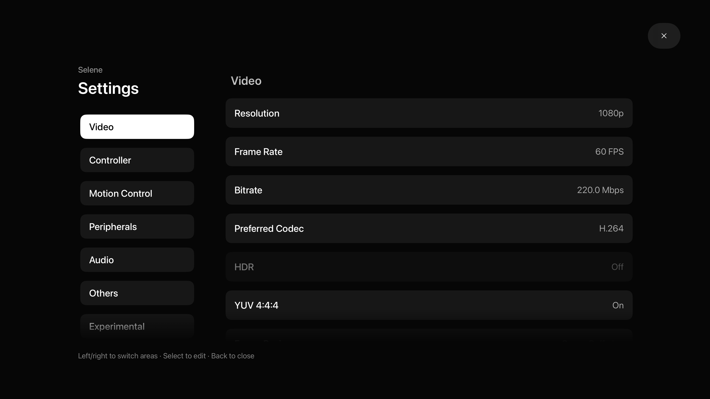
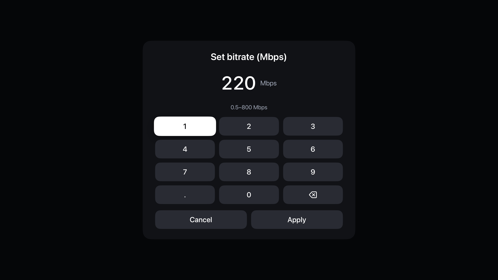

# Selene verification

Updated: 2026-10-06. Implementation, simulator checks, user feedback and physical streaming measurements are distinguished below.

| Check | Result and evidence |
| --- | --- |
| Project, scheme, target and app rename | Passed: Xcode 27 Debug simulator and signed-device builds, plus unsigned-device Release build; current app is Selene |
| Existing pairing/settings compatibility | Bundle ID and store keys retained; active Core Data model byte-identical to baseline; saved simulator bitrate and language retained after relaunch |
| Startup keyboard prewarm | Disabled on tvOS; 5 simulator launches completed. Transient launch captures alone do not prove absence of every keyboard flash |
| Touch control menu | tvOS creation and old-configuration restoration disabled; physical streaming observation pending |
| Host list persistence and focus restoration | 10 simulator settings round trips retained the discovered host and restored gear focus. User reported the installed host/app flow was working well; independent physical stream-return capture pending |
| Host-to-app entry and app-card focus | Single paired-host entry and whole-card animation implemented. User feedback was positive; app-grid/controller edge cases still need physical checks |
| Resolution policy | Passed: 720p/1080p/2560×1440/3200×1800/4K, custom even dimensions, device limits and invalid-input checks. Fullscreen removed from tvOS choices |
| Bitrate policy | Passed: 150/160/200/300/800 Mbps, exact values, bounds and non-finite values; no 150 Mbps cap in tested policy |
| Bitrate editor focus and input | Passed in 3840×2160 simulator: visible −/+, down-navigation to exact entry and Done, replacing values, Cancel, invalid 0 feedback and Apply |
| Bitrate step sizes | Passed: 200→190, 190→200→210→235 and 235→210→185; 10 Mbps when current value ≤200 Mbps, 25 Mbps above it |
| Localization | Passed: stored preference, system selection, invalid preferences, 16 region/fallback cases and English/Simplified/Traditional Chinese coverage |
| Current icon | Accepted minimalist illustration subtly polished; inspected at 400×240, compiled and installed. Earlier rabbit/textured/vector drafts are superseded |
| Physical install | Passed: signed Debug build and update installation on Apple TV 4K, tvOS 26.6 |
| 160/200 Mbps 4K60 throughput, loss and latency | Not validated |
| 30-minute HDR10 and SDR retry | Not validated on a physical stream |
| Hardware-positive AV1 device | Not validated; no software decoding is enabled |
| Host rejection, decoder failure, display failure and network interruption | Handling implemented where recorded in source; end-to-end acceptance pending |
| Game-controller input and physical surround output | Not validated |
| Dolby Vision / Atmos / height-channel layouts | Not supported by the current stream path |

## Devices and evidence

The actual connected device is a **second-generation Apple TV 4K (AppleTV11,1)** running tvOS 26.6, not the third-generation device initially requested. The simulator is Apple TV 4K at 3840×2160 on tvOS 27. Simulator display size does not establish a 4K stream or physical decoder capability.

The English settings screenshot below has a saved 1080p stream setting. Simulator hardware detection can disable 4K/HDR choices; this is not evidence of the physical device's capabilities. Saved 220 Mbps survived the rename and relaunch checks.

Private host addresses, pairing screenshots, signing details and local device logs are excluded from publication. An earlier physical screenshot showed the system screensaver; installation and process launch are not treated as proof of streaming behavior.

## Acceptance still required

Measure real 4K60 streams at 160 and 200 Mbps, with receive bitrate, loss, latency and decode time; run HDR10 for 30 minutes and exercise SDR retry. Test host refusal, decoder initialization failure, unsupported display output and network interruption. Verify offline/WOL behavior, deleting the focused host/app, custom-resolution remote input, stream-return focus, controller input and actual stereo/5.1/7.1 output.

800 Mbps is a configuration ceiling, not a stable-throughput promise. HDR10 is not Dolby Vision, and Opus-to-PCM surround audio is not Dolby Atmos.

## GitHub publication and clean checkout

Public repository: [jacobswin/Selene](https://github.com/jacobswin/Selene), default branch `main`. Original Git history and recursive submodule pins are retained.

A fresh recursive clone from GitHub succeeded. In that clone, all three production-policy suites passed, README images and local document links resolved, and the documented `bash BuildScripts/build-tvos.sh Debug` command built successfully under Xcode 27 without sharing the original checkout's build or package caches.

GitHub-hosted unsigned Debug and Release builds passed under Xcode 26 after tvOS platform support was provisioned: [successful CI run](https://github.com/jacobswin/Selene/actions/runs/37487413024). The earlier missing-platform failure was an environment setup issue and is retained in Actions history.

The publishable tree was checked for local device identifiers, pairing evidence, signing files and credential patterns; no such material was found. This build verification does not change the physical-stream acceptance limits above.

## 2026-10-07: audio cleanup and stream menu

- Implemented one tvOS Stereo choice, 5.1 and 7.1; removed unsupported placeholder layouts. Legacy system/SDL stereo values resolve to Stereo, existing surround values remain valid.
- Added the Back/Menu stream dialog with Continue, Stream settings, Disconnect, and confirmed Disconnect and close app. Existing quit request/error handling is reused. Settings presentation uses the visible stream controller and tracks streaming state.
- Unsigned tvOS Debug, simulator Debug and signed device Debug builds passed. Production audio preference compatibility, bitrate, resolution and localization checks passed.
- On the 3840×2160 simulator, remote navigation opened Audio Configuration and showed exactly Stereo / 5.1-channel / 7.1-channel plus Cancel. Existing 5.1 preference remained selected. This is UI evidence, not physical surround-output validation.
- Actual live-stream menu dismissal, settings return, both exit actions, host rejection, keyboard/controller interaction and application focus restoration remain unverified on the Apple TV. Track them separately from implemented code.
- Reviewed the user-provided Android stream-menu photo and all 14 settings photos. Matching English/Chinese README checklists and the Android feasibility review record client tasks, host/platform investigations and excluded touch/Android-only features. Personal reference photos are not published.

### Stage 1: native stream overlay and shared bitrate requests

- Implemented the dark two-column stream overlay, reused exact bitrate keypad, live received-bandwidth readout, Off/Compact/Detailed statistics and existing exit actions.
- Unified settings/menu requests with a serial coordinator; 5-second host timeout, acknowledged-target rollback, persisted manual targets and stream-generation isolation. Menu input suspension sends keyboard releases and neutral controller/mouse states; full settings returns to the menu.
- Unsigned tvOS Debug build passed. Production coordinator tests passed for overlapping requests, rejected mutations, persistent manual targets, stale responses and transient automatic targets. Existing bitrate/audio policy checks passed.
- Removed exactly the 14 specified local reference attachments; no reference photos are tracked. Live Apple TV overlay/input/exit acceptance remains pending.

### Stage 2: explicit keyboard actions

- Added Alt+Tab, Windows, Esc, Enter, special keys and an explicit native text editor. Text cancel does not send Enter. Shortcuts use balanced key-down/up sequences and reverse modifier release; session teardown releases pending keys and stale completion cannot resume a new session.
- tvOS Debug build passed. Production key-sender tests passed for Alt+Tab order, ordinary-input suspension, explicit bypass, and cancellation cleanup. Physical PC text entry and shortcut effects remain pending.

### Stage 3: capability snapshot

- Shared read-only device, requested and negotiated sections in settings and the stream menu. Actual decoder format, VideoToolbox hardware-use result, dimensions, frame rate, decode time and negotiated audio channels come from session data.
- Current display HDR format remains unknown where tvOS provides no reliable observation. Audio-session channel count does not certify receiver output. Dolby Vision, Atmos and height channels remain unsupported.
- Unsigned tvOS Debug build and missing/invalid numeric snapshot tests passed. HDR output and audio receiver verification remain pending on Apple TV.

### Stage 4: picture geometry

- Added persistent fit/stretch, nine anchors, 1% horizontal/vertical adjustment bounded to ±50%, and reset controls in settings and the menu.
- Transform only the video render surface, leaving overlays and input view full-size. Geometry updates preserve the decoder session and requested dimensions; the old ScreenChanged notification was deliberately avoided because it recreates the decoder.
- Pure geometry tests passed for wide black bars, independent stretched axes, anchors, clamped offsets and inverse pointer coordinates. tvOS currently uses relative GameController mouse input; absolute pointer conversion rejects black-bar coordinates rather than clamping them to the video edge. Real-device framing and mouse acceptance remain pending.

### Stage 5: adaptive bitrate and final build checks

- Opt-in only, persistent enable/bounds preferences with safe defaults (saved manual upper limit, 25% lower limit, 0.5 Mbps floor, 800 Mbps ceiling). Automatic targets affect only the active session; manual edits disable automation and persist even when equal to the live target.
- Samples structured complete video windows once per second. Two >1% network-frame-loss samples or three RTT samples > baseline +20 ms and >1.5x baseline reduce target 20%; 15 healthy seconds (<0.1% loss, RTT within baseline*1.2 +5 ms) raise it 5%. A five-second cooldown follows requests. Decode/render frame drops are not network packet loss and do not trigger this algorithm.
- Reject missing/no-video/duplicate/reset windows and reset streaks after gaps. Unsupported host responses stop automation; three other failures pause it. Last accepted target remains, with an explicit Enable/Resume action.
- Production policy and transport/coordinator tests passed for cooldown, bounds, RTT/loss streaks, invalid windows, unsupported hosts, three timeout statuses, manual override and storage isolation. Input gate also covers controller motion and X1 mouse callbacks.
- Unsigned stage 5, signed Apple TV Debug and 4K simulator builds passed; installed on the existing Apple TV without changing its bundle identifier. The prior four GitHub stage builds passed.
- Mac was locked during the attempted simulator UI inspection. Therefore new overlay geometry, native focus, keyboard interaction, three-language visual review, live 4K throughput/HDR/audio and actual adaptive network behavior remain unverified on screen; no new screenshots were published. Real-device acceptance stays unchecked.

### Delivery follow-up

- All ten tvOS test scripts passed. Final 4K simulator and signed device builds passed after the localization/resource updates.
- When adaptive control is enabled before starting a stream, settings now explicitly show “Enabled for next stream” instead of implying that the preference was ignored.
- Latest GitHub Debug/Release checks were still running at handoff; the four preceding stage commits completed successfully. Physical acceptance remains pending because the Mac is locked and the live stream has not been observed.
